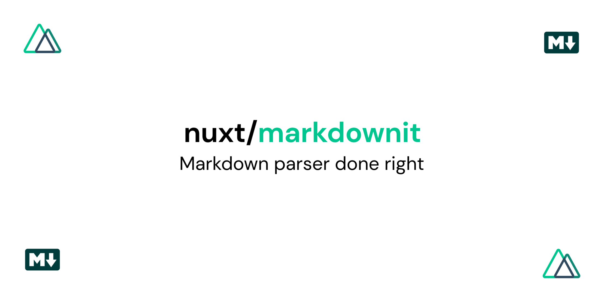

# Markdownit

  <a href="https://markdownit.nuxtjs.org">Documentation</a>

Using [markdownit-loader](https://github.com/nuxt-community/markdownit-loader) and [markdown-it](https://github.com/markdown-it/markdown-it)
# Markdownit

Using [markdownit-loader](https://github.com/nuxt-community/markdownit-loader) and [markdown-it](https://github.com/markdown-it/markdown-it)

## Contributing

1. Clone this repository
2. Install dependencies using `yarn install` or `npm install`
3. Start example in development server using `yarn dev` or `npm run dev`
4. Before to push, execute `yarn test` or `npm test`

## License

[MIT License](./LICENSE)
